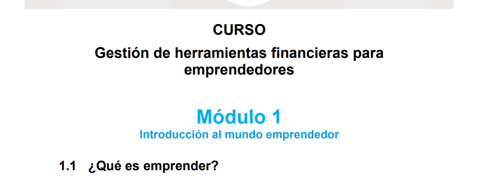
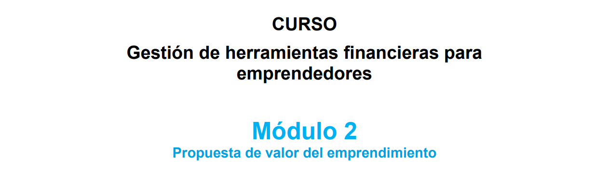
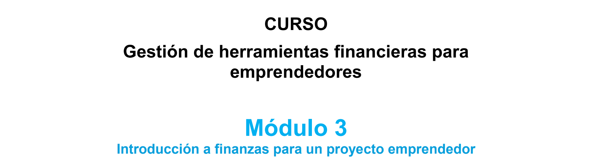
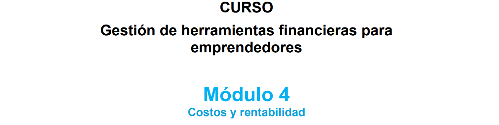

<h2 align ="center">Gestion de Herramientas Financieras para Emprendedores</h2>
<h5 align ="center">Este es el video de presentacion del curso que realize</h5>

  

<h3 align ="center">Desarrollo del curso</h3>

 El curso se divide en 4 Modulos:

<h6>Modulo 1:</h6>

Aprendi la introduccion en el pensamiento de diseño, la importancia de generar la idea de negocio y formas de llegar a ella.
También vi los criterios a considerar para determinar cuál es una buena idea de negocio.

 "Presionar" la Imagen para ir al modulo 1

 

<h6>Modulo 2:</h6>

Aprendi sobre como saber si una idea es viable o atractiva para nuestros potenciales clientes por lo cual aprendi sobre la propuesta de valor y los pasos para crear el lienzo de la propuesta de valor.

 "Presionar" la Imagen para ir al modulo 2

 

<h6>Modulo 3:</h6>

En este tercer módulo aprendi sobre las finanzas de nuestro emprendimiento y de algunos conceptos clave que necesitamos entender para poder organizarlo de modo que sea sostenible y rentable en el tiempo.

 "Presionar" la Imagen para ir al modulo 3

 

<h6>Modulo 4:</h6>

Explicaron en qué consiste y cuáles son los conceptos clave a considerar para calcular los costos asociados a tu producto o servicio.

 "Presionar" la Imagen para ir al modulo 4

 

