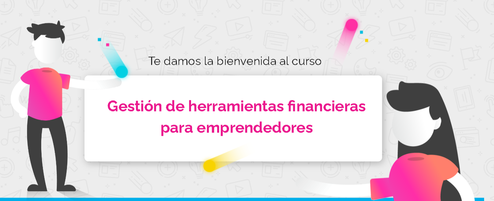

<h2 align ="center">Gestion de Herramientas Financieras para Emprendedores</h2>
<h5 align ="center">Este es el video de presentacion del curso que realize</h5>

<h3 align ="center">Conceptos Aprendidos en el curso</h3>

 El curso se divide en 4 Modulos:

<h6>Modulo 1:</h6>

Aprendi la introduccion en el pensamiento de diseño, la importancia de generar la idea de negocio y formas de llegar a ella.
También vi los criterios a considerar para determinar cuál es una buena idea de negocio.

